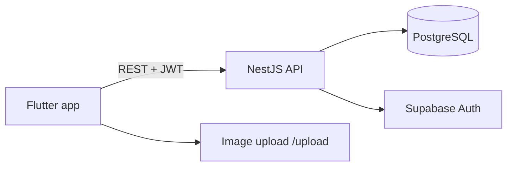

# Vyral — Presentation / demo outline (5–8 minutes)

Use this structure for the **SRS & presentation (4 marks)** rubric category.

---

## 1. Introduction (30 s)

- **Product:** Vyral — share photos and captions, discover content, follow people.  
- **Stack:** Flutter + NestJS + PostgreSQL (Supabase Auth).  
- **Team:** Name each member and one sentence on their contribution.

---

## 2. Architecture (45 s)

- Show repo folders: `frontend/lib/screens`, `services`, `backend/src/posts`, `auth`.

---

## 3. Flutter concepts (45 s) — rubric: 5 marks

| Concept | Demo / file |
|---------|-------------|
| Multi-screen navigation | Open Welcome → Login → Home; mention routes in `main.dart` |
| Lists with models | Home feed `ListView.builder` + `FeedPost` model |
| Stateful UI | Like a post (count updates), toggle dark mode in Settings |

---

## 4. Live demo — core flows (4–5 min) — rubric: 10 marks functionality

1. **Register** new user (show validation: email, password strength).  
2. **Log in** (or use test account).  
3. **Create post** — image + caption; show validation if both empty.  
4. **Home feed** — switch For You / Following / Trending; pull to refresh.  
5. **Interact** — like, open comments, save to collection.  
6. **Explore** — search keyword; tap post → detail.  
7. **Profile** — open another user → Follow; open own profile → Edit profile.  
8. **Owner actions** — ⋮ on your post → Edit caption → Delete (confirm).  
9. **Saved** — open collection.  
10. **Settings** — theme toggle → **Log out**.

---

## 5. Backend (30 s) — rubric: 4 marks

- Open Swagger: http://localhost:3000/docs  
- Mention: validation pipe, JWT guard, posts CRUD, upload endpoint.  
- Optional: show one successful request in network tab.

---

## 6. UI/UX (20 s) — rubric: 10 marks

- Consistent theme (light/dark), typography (Inter / Playfair).  
- Navigation: bottom nav + drawer.  
- Wide screen: resize Chrome window — content stays centered.

---

## 7. Q&A prep

- **Why NestJS?** Structured modules, DTO validation, Swagger.  
- **State management?** `setState` + `ListenableBuilder` on `AuthService` (no extra package required for course scope).  
- **What’s not built?** Stories, reels, DMs — out of scope per SRS.

---

## Pre-demo checklist

- [ ] Backend running: `npm run start:dev` in `backend/`  
- [ ] Flutter running: `flutter run -d chrome` or `Vyral_API34`  
- [ ] Test account or plan to register live  
- [ ] SRS PDF submitted with team names filled in Section 1.3  
